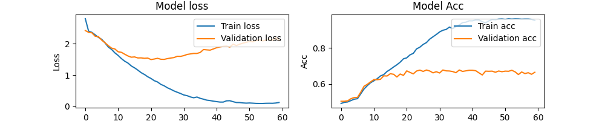

# Step 2
## File Structure
- ``config.py``: Paths/Flags settings
- ``annots.py``: Convert pdf with annotation to jsonl dataset
- ``preprocess.py``: Extract features from dataset
- ``model.py``:  Train the ML models
- ``main.py``: Predict tags in sentence based on the model trained

## Get Annotation from mendeley
Same as step1.

**Note:** Sticky Notes paired with highlights are based on if one note is inside one highlight's rectangle. Some annotation may be misising due to following possible situations:
- Multiple notes are paired with one highlight
- Notes can not be paired with any highlight

## Extract tag with ML model
1. Configure ``config.py`` for path settings.
2. Run ``annots.py``, this generates jsonl dataset for training from annotated pdf. It also generates ``class.txt`` which contains all the tags labeled.
```
python annots.py
```
**Note:** In jsonl, each line is a json sample with the formats of [words:list, tags:list]. The tags and words are one to one correspondence (two lists have same length). The words are pymupdf words (i.e. may not be a natural word).
3. Concatenate the jsonl to generate the final file. (change accordingly as **dataset_folder** in ``config.py``)
```
cat dataset/*.jsonl > all.jsonl
```
4. Run ``preprocess.py`` to do feature extraction and sampling for training the models. This generates one pickle file **preprocessed_file** for the preprocessed dataset.
5. Run ``model.py`` to train the model. This generates ``model.h5`` which is the trained model.
```
python model.py
```
6. Run ``main.py`` to use the trained model to predict tags from sentence.
```
python main.py
```

## Training history of Character-level RNN
